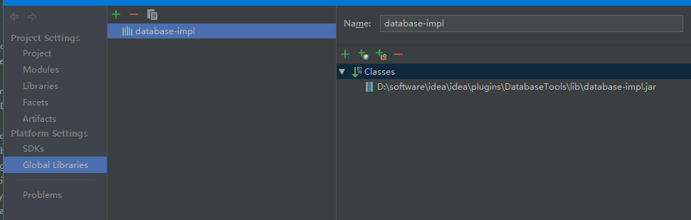
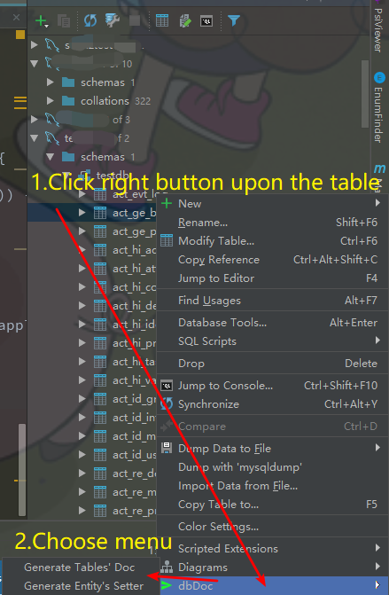

### BeanUtils-copyProperties Plugin

[Plugin Home Page](https://plugins.jetbrains.com/plugin/14343-dbdoc)

---

Add the `database-impl.jar` as project lib or global lib, you can find it in your idea installation directory.

---

Usage

